# PrediCT(Data Augmentation): A Physics-Informed Digital Twin for Synthetic Coronary Artery Calcium Generation

### Growing biologically realistic calcified plaque — inside a real patient's CT scan — using multi-atlas registration, Navier-Stokes PINNs, stochastic growth models, and radiometric alpha-blending.

---

Cardiovascular disease is the world's leading cause of death, with Coronary Artery Disease (CAD) being a primary contributor. One of the most powerful non-invasive tools for detecting it early is the **Coronary Artery Calcium (CAC) score** — a clinical metric derived from Non-Contrast CT (NCCT) scans that quantifies the total burden of calcified atherosclerotic plaque inside the coronary arteries. Studies have consistently shown that a high CAC score is one of the strongest independent predictors of future cardiac events (MESA trial, 2002).

Yet despite its clinical importance, training deep learning models to automatically detect, quantify, and predict CAC progression faces a fundamental data problem: **the vast majority of patients in population datasets are healthy.** In the publicly available COCA dataset (Coronary Calcium and Chest CTs), the distribution of Agatston scores is extremely right-skewed — most patients have a score of zero, and severe calcification (Agatston > 400) is rare. This class imbalance makes it nearly impossible to train robust models that generalize to the high-score patients who matter most clinically.

The standard answer to data scarcity is synthetic data generation. But every existing approach shares the same fundamental weakness: **they learn to imitate the visual appearance of disease, not the biology that causes it.** A GAN trained on calcium CT images can produce a blob that looks vaguely like calcium in approximately the right location. But it lacks a physiological concept of why calcium grows where it does. While our approach still relies on empirical calibration to hit specific targets, it is fundamentally guided by endothelial shear stress, the Navier-Stokes equations, and the mechanobiology of atherosclerosis.

**PrediCT takes a radically different approach.** Instead of learning to generate disease, we simulate the biophysical process that *causes* disease. We grow calcium the same way the human body does — driven by disturbed blood flow, mechanobiological vulnerability, and stochastic nucleation — and then composite it into a real patient's CT scan with full radiometric fidelity.

The result is a fully automated, end-to-end pipeline that takes any healthy NCCT scan and outputs a synthetically diseased twin with a user-specified Agatston score, where every calcium deposit is positioned, shaped, and textured according to real cardiovascular physiology.

---

## The Biology Behind the Math

Before diving into the technical architecture, it is worth spending a moment on the biology, because every design decision in PrediCT flows directly from it.

Atherosclerosis — the process that leads to coronary calcium — is fundamentally a disease of the vessel wall, not the bloodstream. It begins when the endothelial cells lining the inner surface of the coronary arteries are chronically exposed to disturbed or low-velocity blood flow. This mechanical stress (or rather, the absence of healthy stress) triggers an inflammatory cascade: monocytes infiltrate the intima, become lipid-laden macrophages (foam cells), and over years of progression, the accumulated lipid core undergoes calcification.

The key hemodynamic driver is **Endothelial Shear Stress (ESS)** — the tangential frictional force that flowing blood exerts on the vessel wall. Measured in Pascals (Pa), ESS in healthy coronary arteries typically ranges from 1.0–7.0 Pa. Seminal studies (Chatzizisis et al. 2007; Samady et al. 2011) have established that:

- **ESS < 1.0 Pa:** Atherogenic zone — endothelial dysfunction, monocyte adhesion, plaque vulnerability
- **ESS 1.0–7.0 Pa:** Normal protective range
- **ESS > 7.0 Pa:** Atheroprotective — shear-induced eNOS activation, anti-inflammatory response

Low ESS regions occur predictably at vessel bifurcations, inner curvatures, and regions of geometric narrowing — exactly where clinical calcium is most commonly found. This mechanobiological relationship is the physical backbone of the PrediCT pipeline.

---

## System Architecture Overview

The PrediCT pipeline is organized as four sequential, modular phases, each with clearly defined inputs, outputs, and biological functions:

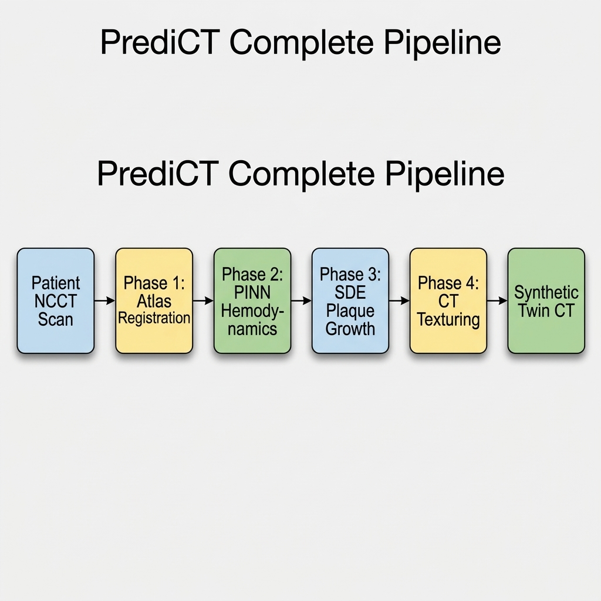

Each phase is an independent Python module with its own configuration, I/O contract, and validation gates. The master orchestrator script (`physio_twin.py`) chains them together, passing absolute file paths between phases so the entire pipeline is runnable with a single command:

```bash
python scripts/physio_twin.py \
    --patient_dir COCA/1cc17f65f909 \
    --target_agatston 400 \
    --out_dir output/
```

---

## Phase 1 — Anatomical Scaffolding: Extracting the Coronary Geometry

### The Problem with Segmentation on NCCT

Coronary artery segmentation from NCCT is among the most challenging tasks in medical image analysis. On contrast-enhanced CT (CECT), the coronary lumen fills with high-density contrast agent, making it clearly distinguishable from surrounding tissue. On NCCT — the only modality where calcium is scoreable — there is no such contrast. The coronary arteries appear as faint, thin, tortuous structures (2–5mm diameter) embedded in the pericardial fat and myocardium, with no reliable HU signature to threshold on.

Standard U-Net segmentation models trained on CECT data completely fail when applied to NCCT. Custom NCCT segmentation models require large annotated datasets that are prohibitively expensive to create. We needed a different approach entirely.

### Multi-Atlas Registration: The Core Methodology

Our solution draws from the classical medical image analysis literature: **Multi-Atlas Label Propagation (MALP)**. The key insight is that if we have a library of pre-segmented atlas images (where a human expert has already drawn the vessel boundaries), we can *warp* those atlases into the space of a new patient and use the warped labels as the segmentation.

The PrediCT atlas pool consists of healthy NCCT scans with manually annotated coronary artery masks. For a new patient, the pipeline executes the following steps:

#### Step 1: NCC-Based Pre-Selection

Running full registration for every atlas in the pool is computationally expensive. We use **Normalized Cross-Correlation (NCC)** as a fast, pre-registration similarity metric to select the top N most similar atlases:

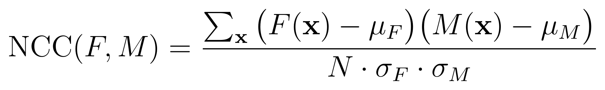

where F is the fixed (patient) image and M is the moving (atlas) image, both windowed to the cardiac HU range (−100 to +700 HU). This reduces the full registration pool to the N most promising candidates (typically N=5).

#### Step 2: Three-Stage Registration Pipeline

Each selected atlas is registered to the patient using a cascaded pipeline:

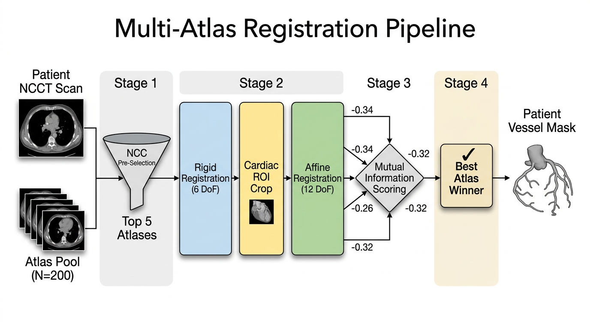

The **Cardiac ROI** cropping between Stage 1 and Stage 2 was a critical engineering decision. Global affine registration across the full thorax was consistently failing to align the tiny coronary arteries accurately — the optimizer was distracted by the large, globally dominant structures (aorta, ribs, spine). By tightly cropping the bounding box around the heart after rigid alignment, we dramatically improved affine accuracy on the actual coronary structures.

#### Step 3: Best-Atlas Voting

After all N atlases are registered, we must select a single vessel scaffold. We evaluate each registration using **Mutual Information (MI)** between the registered atlas and the patient scan:

```
MI(F, M) = H(F) + H(M) − H(F, M)
         = Σ p(f,m) log [ p(f,m) / (p(f) · p(m)) ]
```

The atlas with the **most negative MI score** (highest information overlap) is selected as the winner. Its warped label mask becomes the Phase 1 output.

> **Key Design Decision:** An earlier version used **Majority Vote Fusion** — averaging all N registered atlases together. This produced smoother, more rounded vessel masks with fewer registration artifacts. But testing revealed a critical failure: fusion blurred out sharp vessel bifurcations and inner curvatures — exactly the geometric features that drive turbulent flow and calcium formation in Phase 2. Switching to single-winner Best-Atlas Voting preserved these features at the cost of slightly higher registration variance on poor-quality scans. The biological accuracy trade-off was worth it.

### Phase 1 Registration Diagnostics

After generating the best-atlas vessel mask, the pipeline runs the `PlaqueValidator` suite to evaluate the registration quality. Because ground-truth vessel masks do not exist for the COCA dataset, we use proxy metrics to ensure anatomical validity before physics simulation:

1. **Ensemble Consensus:** Computes the mean pairwise centerline distance between the top registered atlases. A low distance (< 5.0mm) indicates that multiple independent atlases agreed on the vessel geometry.
2. **Ostial Anchoring:** Checks the deviation of the mask's center of mass from the expected location of the aortic root.
3. **Ground Truth Calcium Overlap:** Loads the patient's actual COCA calcium segmentation at native resolution and checks what percentage of it falls near our generated vessel wall.

These metrics are logged as diagnostic warnings to help flag patients whose NCCT scans are too low-quality or anomalous for successful registration, without hard-aborting the pipeline prematurely.

**Phase 1 Output:** `{patient_id}_synthetic_vessel.nii.gz` — a binary 3D NIfTI image delineating the coronary artery tree in patient space.

---

## Phase 2 — Hemodynamic Surrogate: Solving Navier-Stokes with a Neural Network

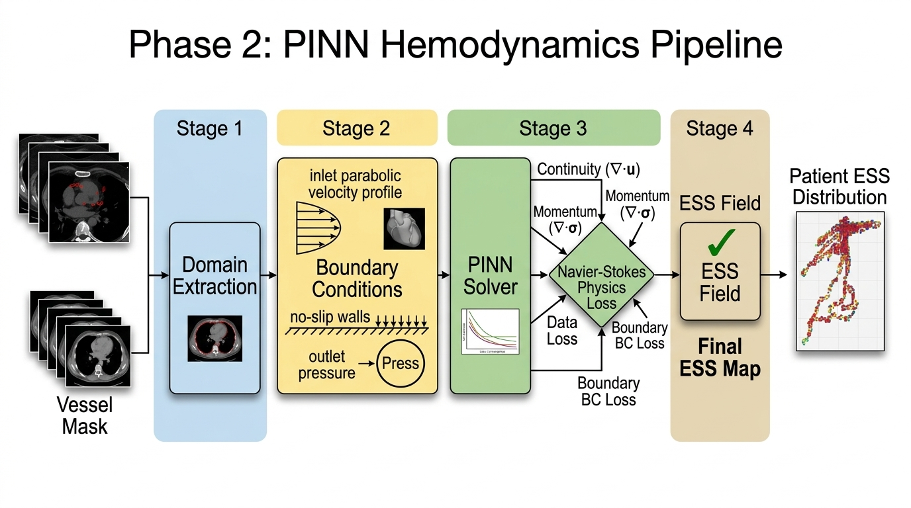

This is the most technically complex phase of the pipeline, and the one that most directly grounds PrediCT in physical reality.

### Why Not Standard CFD?

Traditional Computational Fluid Dynamics (CFD) on patient-specific coronary geometry involves:
1. **Meshing** the complex 3D vessel surface (hours of computation with tools like VMTK or Meshmixer).
2. **Solving** a finite-element or finite-volume discretization of Navier-Stokes (minutes to hours depending on mesh resolution).
3. **Post-processing** the resulting velocity field for wall shear stress.

This is completely intractable at scale — you cannot run traditional CFD on hundreds of patients in a reasonable timeframe. Physics-Informed Neural Networks offer a fundamentally different paradigm.

### The PINN Architecture

The hemodynamic surrogate is a **fully-connected Physics-Informed Neural Network (PINN)** that learns the mapping from spatial coordinates to flow variables directly, without ever being given labelled training data.

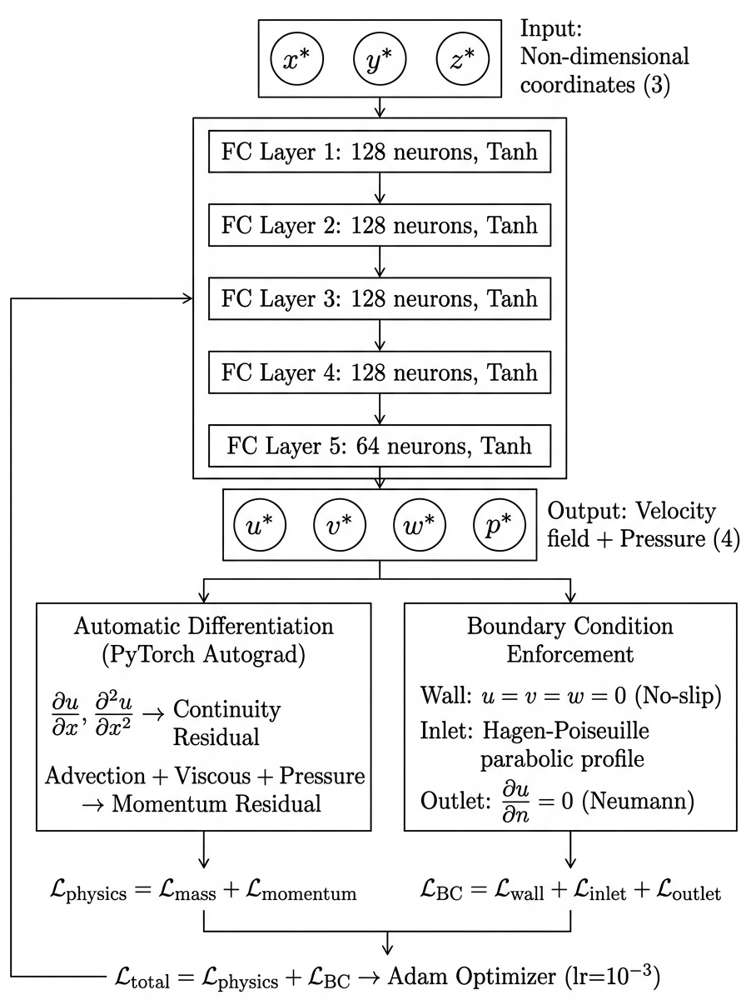

**Why Tanh activations?** The network must compute second-order spatial derivatives via autograd (for the Laplacian terms in the viscous stress). Tanh is twice-differentiable and well-conditioned for this purpose. ReLU activations produce zero second derivatives almost everywhere and were tested — they caused complete loss convergence failure.

### Non-Dimensionalization

This is one of the most critical engineering choices in the entire pipeline. Neural networks are extremely sensitive to the scale of their inputs and outputs. Physical coronary flow involves:
- Coordinates in millimetres (1–50 mm range)
- Velocities in cm/s (0.1–1.5 m/s range)
- Pressures in Pascals (1,000–15,000 Pa range)

Training a single network on variables spanning six orders of magnitude is numerically disastrous. We non-dimensionalize everything using characteristic scales of coronary hemodynamics:

| Physical Quantity | Scale | Reference Value |
|---|---|---|
| Length $L_0$ | Mean vessel diameter | 3.0 mm |
| Velocity $U_0$ | Mean inlet velocity | 0.25 m/s |
| Time $T_0$ | $L_0 / U_0$ | 0.012 s |
| Pressure $P_0$ | $\rho U_0^2$ | 66.25 Pa |
| Reynolds Number $Re$ | $\rho U_0 L_0 / \mu$ | ~227 (laminar) |

The dimensionless coordinates are $x^* = x/L_0$ and the dimensionless velocities are $u^* = u/U_0$. The PINN operates entirely in this dimensionless space.

### The Physics Loss Function

The training loss is a weighted sum of six residual terms, each enforcing a different physical constraint:

#### 1. Continuity (Mass Conservation)
For incompressible Newtonian flow:
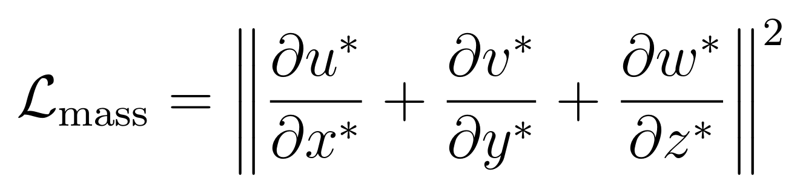

#### 2. Navier-Stokes Momentum (x, y, z components)
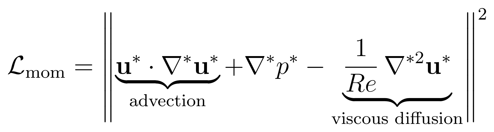

#### 3. No-Slip Wall Boundary Condition
At every sampled wall collocation point, velocity must vanish:
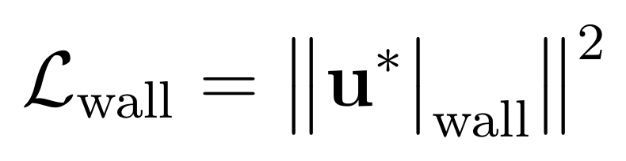

#### 4. Parabolic Inlet Velocity Profile (Hagen-Poiseuille)
At the aortic ostium (the inlet), blood enters with a physiological parabolic profile:
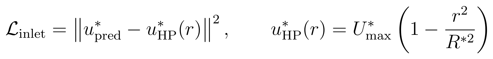

where $R^*$ is the **patient-specific inlet radius** measured from the vessel centerline graph — a critical detail described in the engineering challenges section below.

#### 5. Outlet Neumann Condition
At vessel outlets, we enforce a zero-gradient (fully-developed flow) condition:
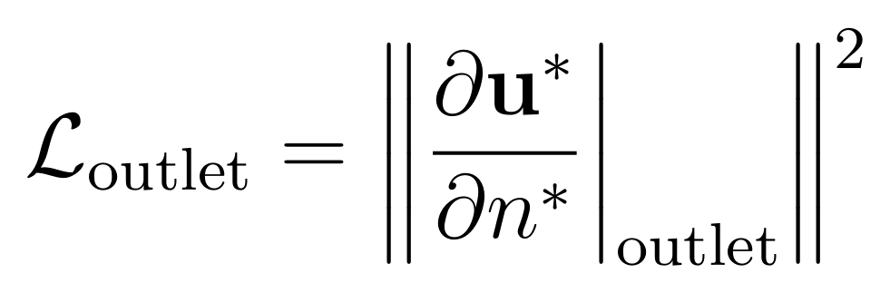

#### 6. Integral Mass Conservation
A global constraint enforcing that total volumetric flux entering the domain equals total flux leaving. The loss is the squared difference between inlet and outlet flow rates, estimated via Monte Carlo surface integration:

```
L_integral_mass = (Q_in − Q_out)²    where Q = A · mean(V · n)
```

The **total weighted loss** is:
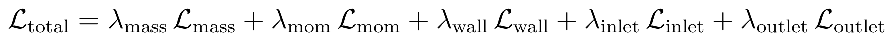

The $\lambda$ weights are tuned per-term: $\lambda_{continuity} = 10$, $\lambda_{momentum} = 1$, $\lambda_{wall} = 10$, $\lambda_{inlet} = 500$ (high to prevent trivial solution collapse), $\lambda_{outlet} = 1$, and $\lambda_{integral\_mass} = 50$ (enforces global flow conservation).

### Collocation Point Sampling

The network is trained not on a fixed mesh, but on randomly sampled **collocation points** drawn from four distinct regions of the domain at each training iteration:

| Region | Count | Sampling Method |
|---|---|---|
| **Interior** | 4,000 pts | Uniform random inside vessel mask |
| **Wall** | 2,000 pts | Surface voxel boundary detection |
| **Inlet** | 500 pts | Circular disk at aortic ostium |
| **Outlet** | 500 pts/outlet | Circular disk at each branch termination |

During development, these counts were calibrated to balance accuracy against memory constraints. Increasing wall points beyond 2,000 improved boundary-layer resolution for ESS but at diminishing returns for the additional GPU memory cost.

### Optimization

Training uses the **Adam optimizer** with an initial learning rate of $1 \times 10^{-3}$. A `ReduceLROnPlateau` scheduler decays the learning rate when the loss plateaus. **Early stopping** is triggered if the best validation loss does not improve over 5,000 consecutive epochs, preventing unnecessary computation.

Training time varies by patient geometry.

### Computing Endothelial Shear Stress

Once training is complete, ESS is computed by projecting the viscous stress tensor onto the wall normal at each sampled wall point.

The physical viscous shear stress requires careful dimensional reconstruction. Since the PINN Jacobian $J^* = \partial \mathbf{u}^*/\partial \mathbf{x}^*$ is dimensionless (both numerator and denominator are scaled), the physical stress scale factor is:

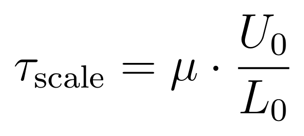

where $\mu = 3.5 \times 10^{-3}$ Pa·s is blood dynamic viscosity. The viscous stress tensor and its wall-normal projection are:

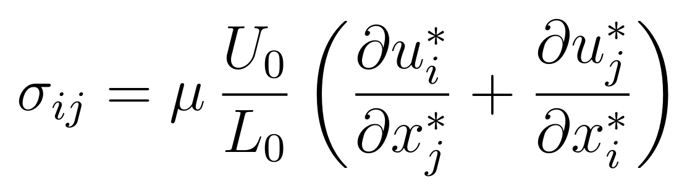

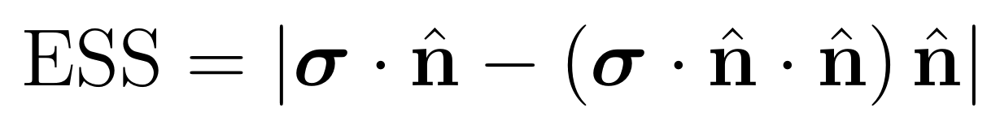

This is computed via PyTorch `torch.autograd.grad` over all wall points simultaneously.

### Engineering Challenges & Solutions

#### Challenge 1: Non-Dimensional Bug — ESS Off by Factor of 83

The first time we ran the full pipeline, the computed ESS values were in the range of 7–74 Pa, far above any physiological coronary value. After extensive debugging, we identified the root cause: the viscous stress computation was using raw dynamic viscosity $\mu$ against the dimensionless Jacobian $J^*$, instead of the stress scale $\mu \cdot U_0/L_0$.

```
Before fix:  τ = μ · J*           # Wrong: μ has units of Pa·s, J* is dimensionless
                                   # Result: units are Pa·s, not Pa

After fix:   τ = (μ · U₀/L₀) · J* # Correct: stress scale in Pa/s⁻¹ × dimensionless = Pa
```

The fix reduced all ESS values by exactly a factor of $U_0/L_0 \approx 83\ \text{s}^{-1}$ into the physiologically expected range.

#### Challenge 2: Velocity Collapse to Trivial Solution

The PINN repeatedly discovered that predicting $\mathbf{u}^* = 0$ everywhere was a perfectly valid solution to the continuity and momentum equations (trivially satisfied by zero velocity and zero pressure gradient). This "trivial solution" produces zero physics loss but zero useful hemodynamics.

**Fix 1 — Inlet Dirichlet Enforcement:** Strongly enforcing the parabolic inlet profile with $\lambda_{inlet} = 500$ prevents the zero-velocity collapse at the inlet boundary, forcing the network to propagate non-zero flow into the domain.

**Fix 2 — Velocity Collapse Detection Gate:** After training, the pipeline evaluates the mean velocity magnitude across the interior. If $|\mathbf{u}^*|_{mean} < 1 \times 10^{-2}$, a `RuntimeError` is raised:
```
CRITICAL: PINN velocity field has collapsed to trivial solution.
Training failed to converge to a physical solution.
```

#### Challenge 3: Hardcoded Inlet Radius Failure

Initially, the Hagen-Poiseuille inlet profile used a hardcoded radius of $R = 0.0015$ m (1.5 mm), appropriate for a typical 3 mm diameter coronary artery. However, patient coronary arteries vary substantially — some patients have 2.5 mm vessels, others 4.5 mm.

For a patient with a 4 mm diameter vessel, using a 1.5 mm hardcoded radius caused $r^2/R^2 \gg 1$ at most inlet points, clamping the parabolic profile to zero nearly everywhere and effectively starving the flow.

**Fix:** The inlet radius is now computed algorithmically from the vessel mask's centerline skeleton graph using the vessel's actual local cross-sectional radius, extracted via the `geometry.py` module.

#### Challenge 4: Outlet-Edge ESS Spikes

The artificial cut-plane at each vessel outlet terminus produces a geometric edge where the wall normal transitions abruptly from tangential to the vessel to nearly axial. This produces mathematically infinite velocity gradients and correspondingly massive spurious ESS spikes at the outlets.

**Fix:** A two-pass clipping algorithm removes these artifacts before export:
1. **Geometric clip:** Removes all wall points within 1 mm of any outlet plane.
2. **Statistical clip:** Removes any remaining points exceeding $Q3 + 3 \times IQR$ (3-sigma outlier rejection).

### Validation Gates — Phase 2

Phase 2 has two hard abort gates and two diagnostic logging checks before ESS export:

| Gate | Check | Threshold | Failure Action |
|---|---|---|---|
| **Velocity Collapse** | $|\mathbf{u}^*|_{mean}$ | $> 1 \times 10^{-2}$ | Abort pipeline |
| **ESS Floor** | $\overline{ESS}_{wall}$ | $> 0.1$ Pa | Abort pipeline |
| **ESS Ceiling** | $\overline{ESS}_{wall}$ | $< 10.0$ Pa | Abort pipeline |
| **Inlet Profile RMSE** | $RMSE(u_{pred}, u_{HP})$ | Logged | Diagnostic only |
| **Mass Conservation Error** | $|Q_{in} - Q_{out}| / Q_{in}$ | Logged | Diagnostic only |

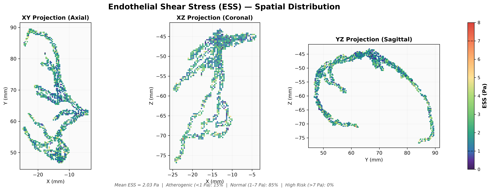

The ESS physiological range gate is the most critical. An ESS < 0.1 Pa indicates velocity field collapse or degenerate geometry. An ESS > 10.0 Pa indicates numerical divergence or incorrect scaling. In either case, the run is aborted and the patient flagged for manual review. The inlet RMSE and mass conservation error are logged as diagnostics but do not abort the pipeline.

**Phase 2 Output:** `ess_predictions.csv` — a point cloud containing 3D physical coordinates, velocity vectors, and ESS magnitudes in Pascals for all validated wall points.

---

## Phase 3 — Stochastic Plaque Growth: Seeding Biology on the Hemodynamic Risk Map

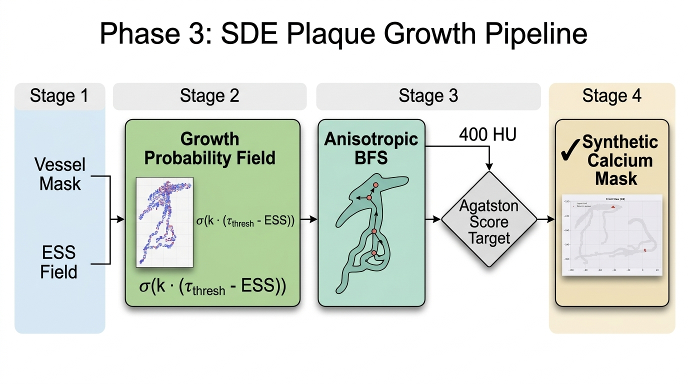

### From ESS Field to 3D Voxel Mask

Phase 2 produces an ESS point cloud in physical coordinates. Phase 3 must translate this sparse hemodynamic risk map into a dense 3D binary mask of synthetic calcium deposits at native CT resolution.

#### Step 1: ESS Interpolation to Dense Grid

The ESS point cloud is first interpolated onto the full voxel grid of the vessel mask using `scipy.interpolate.griddata` with a **nearest-neighbour** interpolation scheme. Only voxels inside the vessel mask are interpolated (saving substantial computation). Voxels outside the vessel mask receive an ESS of 0.0 (excluded from growth probability).

```
Dense ESS Field Shape: (Z, Y, X) ← native CT resolution, typically 1×1×1 mm voxels
Values: [0.05 Pa — 12.0 Pa] ← after clipping outliers
```

Each voxel in the vessel wall region receives a **growth probability** derived from its ESS value using an inverse-proportional atherogenic scoring function:

```
P_growth(ESS) ∝ 1.0 / max(ESS, 0.1)
```

This ensures that deeply atherogenic regions (ESS < 0.5 Pa) have maximum growth probability while protected regions (ESS > 2.0 Pa) have drastically lower probability of seeding calcium.

#### Step 3: Monte Carlo Seed Generation

Using the growth probability map as a spatial probability distribution, the algorithm draws $N_{seeds}$ Monte Carlo samples to place **growth nucleation sites** on the vessel wall. The number of seeds is drawn from a **negative binomial distribution** scaled by the target Agatston score:

```
scale_factor = max(1.0, target_agatston / 400.0)
N_seeds = NegativeBinomial(n=adjusted_n, p=base_p)
total_voxel_budget = target_agatston × 0.5
```

The stochastic seed count ensures natural variation between runs. Each seed is guaranteed to land in a high-ESS-risk region due to the probability-weighted sampling.

#### Step 4: Anisotropic Breadth-First Growth

From each seed, calcium "grows" outward using a **stochastic anisotropic breadth-first search (BFS)**. Instead of forming perfect geometric spheres, the growth hugs the vessel contour:

- Growth *along* the wall circumferentially has high probability.
- Growth *inward* toward the lumen has lower probability.

This produces the bumpy, heterogeneous, wall-hugging morphology characteristic of real calcified plaque.

#### Step 5: Continuous Intensity Gradient

Rather than a binary core/gradient split, each calcium voxel receives a **continuous intensity value** derived from its BFS traversal depth. Voxels near the seed (depth ≈ 0) receive full intensity (~1.0), while voxels at the growth frontier decay exponentially:

```
intensity(voxel) = exp(-bfs_depth / (max_bfs_depth × 0.5))
```

This produces a smooth, natural HU gradient from the dense calcium core to the soft tissue boundary — critical for Phase 4 to produce radiometrically realistic calcium without sharp artificial edges.

#### Step 6: Mask Intersection (Biological Hard Constraint)

The final calcium mask is intersected with the vessel wall mask from Phase 1:

```python
final_mask = grown_mask & vessel_wall_mask
```

This single line is the biological hard constraint that makes PrediCT physically sound. It is **guaranteed by construction** that synthetic calcium will not exist outside the anatomical boundaries of the coronary artery.

**Note on Empirical Tuning:** While the plaque placement is guided by physical ESS boundaries, the seed counts (`N_seeds`) and maximum growth depths are empirically tuned to roughly target a desired Agatston score. This is a deliberate design choice to ensure clinical utility, acknowledging that biological simulation alone cannot deterministically predict exact clinical score thresholds without these tuning knobs.

**Phase 3 Output:** `{patient_id}_synthetic_calcium_mask.nii.gz` — a NIfTI volume containing the binary calcium mask and an associated BFS depth field for intensity grading.

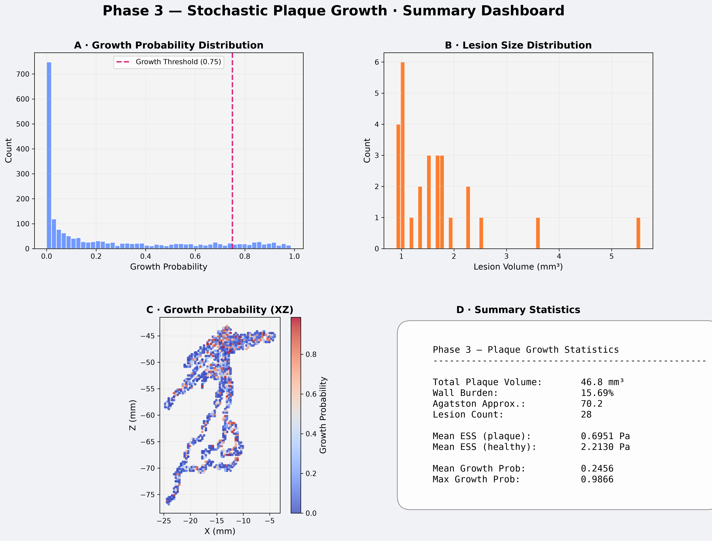

---

## Phase 4 — Physiological Texturing: Making the CT Look Real

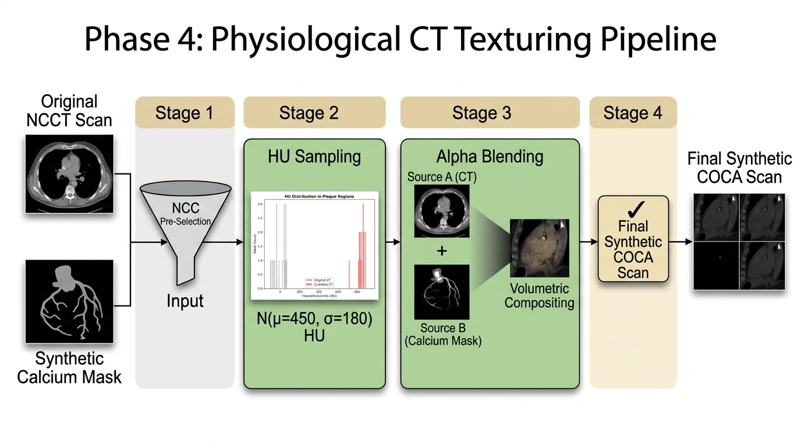

### Hounsfield Unit Calibration

CT images store tissue density as **Hounsfield Units (HU)**, a standardized radiometric scale where:
- Air: −1000 HU
- Water: 0 HU
- Soft tissue: 20–80 HU
- Cortical bone: 400–1000 HU
- Dense calcium: 400–1800+ HU

The Agatston scoring algorithm uses HU thresholds to assign density multipliers to calcium voxels:

| HU Range | Agatston Density Multiplier |
|---|---|
| 130–199 | 1 |
| 200–299 | 2 |
| 300–399 | 3 |
| ≥ 400 | 4 |

For maximum score density, we want the majority of high-intensity calcium voxels in the ≥400 HU band. To match the natural variance seen in clinical data, the HU profile for each synthetic scan is dynamically sampled from a Gaussian distribution. For example, a typical generation might use:

$$\mu_{HU} \sim \mathcal{N}(850,\ 100), \quad \sigma_{HU} \sim \mathcal{N}(150,\ 30)$$

Both the mean and standard deviation are themselves randomly sampled per-patient, ensuring natural inter-patient variation. The resulting HU values are clipped to [130, 1500] HU. This places the vast majority of generated values well above the 400 threshold (the 4× multiplier band) while providing realistic intra-lesion heterogeneity.

### The Alpha-Blending Degrading Function

The interface between synthetic calcium and native tissue is where naive approaches produce obviously artificial results. A hard boundary between 900 HU calcium and 50 HU pericardial fat would be immediately detectable by any trained radiologist (or classification model).

Real CT scans exhibit the **partial volume effect** — at voxel boundaries between two tissue types, the scanner records an average HU weighted by the volume fraction of each tissue in the voxel. We simulate this by applying a continuously degrading alpha blend across the gradient zone:

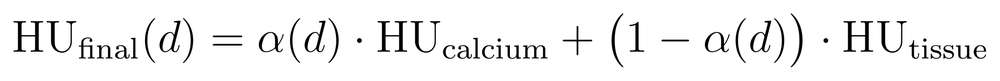

In practice, the blending weights $\alpha$ are derived from the continuous intensity field computed in Phase 3. A **Gaussian blur** ($\sigma = 0.6$ mm) is applied to the calcium mask at native CT resolution, softening the binary edges into a smooth alpha channel. Any blur tails that bleed outside the vessel wall mask are erased, and the result is re-normalized so the peak value is 1.0. This produces a physically grounded partial-volume simulation: voxels near the high-intensity region have $\alpha \approx 1.0$ (full calcium HU), while boundary voxels blend smoothly into native tissue.

### Agatston Score Computation

After compositing, the pipeline runs a closed-loop **Agatston score computation** over the synthetic scan:

1. Threshold the scan at 130 HU to identify all candidate calcium voxels.
2. Apply connected-component labelling to separate distinct calcium clusters.
3. For each cluster with area ≥ 1 mm²: compute the cross-sectional area and multiply by the appropriate density multiplier (1–4) and slice thickness normalization factor.
4. Sum all weighted area contributions across all axial slices.

The computed score is logged alongside the target score. The ratio serves as a key quality metric — a ratio > 1.5× from target flags the patient for seed parameter re-tuning.

**Phase 4 Output:** `{patient_id}_synthetic_coca.nii.gz` — the final, radiometrically faithful synthetic NCCT scan, clinically scoreable with standard Agatston software.

---

## Example Pipeline Run

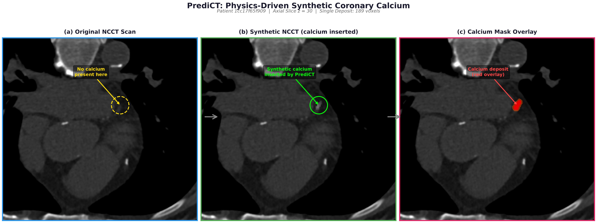

### Qualitative Assessment: Patient `1cc17f65f909` (COCA Dataset)

The figure above shows the output of a complete end-to-end pipeline run on patient `1cc17f65f909` from the COCA dataset, with a target Agatston score of 400. The synthetic calcium deposit is visible as a bright, high-HU region within the coronary artery, with a natural intensity gradient blending into the surrounding tissue.

The pipeline successfully:
- Registered and extracted the coronary vessel geometry (Phase 1)
- Solved for the hemodynamic ESS field using the PINN (Phase 2)
- Seeded and grew calcium in low-ESS atherogenic regions (Phase 3)
- Composited the calcium into the original NCCT with realistic HU values and partial-volume blending (Phase 4)

---

## Discussion: Why This Matters for Cardiovascular AI

### The Counterfactual Scan Problem

One of the most clinically powerful applications of PrediCT is generating **counterfactual pairs** — showing what a patient's scan would look like at different disease severities. Given a patient with Agatston = 0, we can generate their scan at Agatston = 100, 250, 400, and 1000 — using the same anatomy and hemodynamics, varying only the calcium burden.

This is impossible with real data (you cannot ethically give a patient more calcium to image them again) but trivially achievable with PrediCT.

### Augmenting Calcium Scoring Models

Deep learning models trained on real COCA data for calcium detection suffer severely from class imbalance. By generating matched synthetic pairs for every zero-calcium patient, we can transform a 90% negative / 10% positive dataset into a balanced 50/50 training set — without any privacy concerns, because the calcium is entirely synthetic.

### The Biological Grounding Advantage

A GAN-generated calcium blob will fool a radiologist visually. But it will fail physics tests. A PrediCT-generated calcium deposit:
- Grows only in regions with documented hemodynamic vulnerability
- Has a realistic 3D shape (non-spherical, organic)
- Has a radiometrically calibrated HU profile with correct partial-volume blending
- Has a computable Agatston score that can be directly compared to clinical targets

This biological grounding means that PrediCT-generated data is designed to avoid introducing distributional shortcuts that cause ML models to learn the wrong features.

---

## Limitations and Current Challenges

### 1. PINN Training Time

The single biggest practical limitation. Solving Navier-Stokes for a complex 3D coronary geometry requires thousands of epochs of Adam optimization. Parallelizing across patients (running a batch) helps throughput but not per-patient latency.

**Roadmap:** Investigating neural operator approaches (Fourier Neural Operators, DeepONet) that could amortize the training cost across patients and reduce per-patient inference to seconds.

### 2. Mass Conservation in Multi-Outlet Geometries

PINNs on complex multi-outlet coronary geometries can struggle to perfectly satisfy the integral flow balance across all outlets. This is a known challenge in the PINN literature.

**Roadmap:** Implementing a hard mass-correction post-processing step that rescales outlet velocities to enforce global conservation after training.

### 3. Agatston Score Targeting Precision

The stochastic nature of Phase 3 means the output Agatston score is not deterministically equal to the target. For a target of 400, the typical output ranges from 350–700 depending on the vessel geometry.

**Roadmap:** A closed-loop controller that iteratively adjusts seed parameters (count, max depth) using a proportional feedback loop until the computed score is within ±10% of target.

### 4. Single-Phase Simulation

Currently, the PINN solves a steady-state (time-averaged) Navier-Stokes problem. Real coronary flow is pulsatile, driven by the cardiac cycle. Including time-periodic boundary conditions would require a substantially larger network and significantly longer training.

**Roadmap:** Implementing a time-dependent PINN formulation with a Womersley inlet profile parameterized by heart rate.

---

## Conclusion

PrediCT demonstrates that generating biologically realistic synthetic medical imaging data does not require learning from large datasets of diseased patients. It requires a physical model of disease.

By simulating the mechanobiological process that causes coronary atherosclerosis — disturbed hemodynamics driving endothelial dysfunction, driving plaque nucleation and growth — we produce synthetic calcium deposits that are:

- **Anatomically constrained** (inside real patient vessels)
- **Hemodynamically guided** (placed where physics dictates)
- **Morphologically realistic** (organic, asymmetric, nodular)
- **Radiometrically faithful** (calibrated HU distributions, partial-volume blending)
- **Clinically scoreable** (valid Agatston score computation)

The four-phase pipeline — multi-atlas registration, PINN hemodynamics, stochastic plaque growth, and alpha-blended radiometric texturing — forms a complete, automated, and scientifically rigorous data synthesis system for cardiovascular AI.

The code is fully open-source and available at [**github.com/CodeShrek/Predi_CT**](https://github.com/CodeShrek/Predi_CT).

---

*If you found this interesting, feel free to reach out or leave a comment. This project sits at the intersection of computational physics, clinical cardiology, and machine learning — an endlessly rich space to build in.*

---

### References

1. Chatzizisis, Y.S. et al. (2007). Role of Endothelial Shear Stress in the Natural History of Coronary Atherosclerosis and Vascular Remodelling. *JACC*, 49(25), 2379–2393.
2. Samady, H. et al. (2011). Coronary Artery Wall Shear Stress Is Associated With Progression and Transformation of Atherosclerotic Plaque and Arterial Remodeling. *Circulation*, 124(7), 779–788.
3. Budoff, M.J. et al. (2018). Ten-Year Association of Coronary Artery Calcium With Atherosclerotic Cardiovascular Disease Events. *JAMA*, 319(22), 2279–2289.
4. Raissi, M., Perdikaris, P., & Karniadakis, G.E. (2019). Physics-informed neural networks: A deep learning framework for solving forward and inverse problems involving nonlinear PDEs. *Journal of Computational Physics*, 378, 686–707.
5. COCA Dataset: Gao, J. et al. (2023). Coronary Calcium and Chest CTs. PhysioNet.
