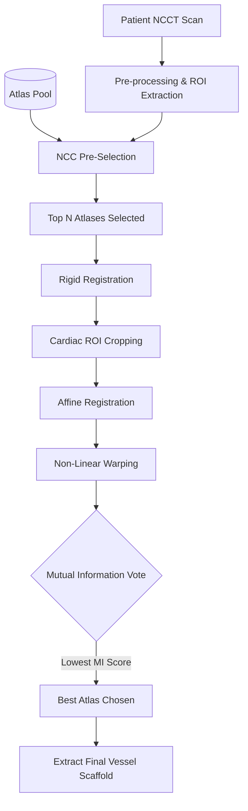

# Phase 1: Anatomical Scaffolding (Best-Atlas Voting)

## Overview
Phase 1 is the foundational step of the Physio-Twin pipeline. Its goal is to generate a highly accurate, patient-specific 3D binary mask of the coronary artery tree from a Non-Contrast CT (NCCT) scan. This vessel mask serves as the absolute anatomical boundary for the fluid dynamics simulation (Phase 2) and the biological constraint for synthetic plaque growth (Phase 3).

## Architecture & Workflow

## Methodology
Instead of relying on standard Unet-based deep learning segmentation (which often struggles with zero-calcium or heavily diseased NCCTs), this pipeline utilizes a **Multi-Atlas Registration Pipeline**. 

We map multiple pre-segmented healthy "atlas" scans to the target patient space. We then evaluate the quality of each mapping and select the single best-fitting atlas to serve as the patient's vessel scaffold.

## Challenges & Solutions

### 1. Challenge: "Bloated" Vessels from Atlas Fusion
**The Problem:** Originally, the pipeline used a "Majority-Vote Fusion" approach, where all registered atlases were merged together. This caused the vessel boundaries to become blurry, bloated, and physically inaccurate, which later ruined the fluid dynamics in Phase 2.
**The Solution:** We transitioned to a **Best-Atlas Voting** system. Instead of fusing, we calculate the Mutual Information (MI) metric between the registered atlas and the patient scan. We select the single atlas with the lowest (most negative) MI score, ensuring crisp, anatomically correct vessel walls.

### 2. Challenge: Registration Failures on Large Scans
**The Problem:** Global Affine registration across the entire chest cavity often failed to align the tiny coronary arteries accurately.
**The Solution:** We implemented an adaptive Cardiac ROI cropping step. After an initial Rigid registration, the algorithm tightly crops the bounding box around the heart *before* attempting the complex Affine and Non-linear warping steps. This drastically improved vessel alignment accuracy.

## Outputs
- `patient_vessels_best.nii.gz`: The final 3D binary mask of the patient's coronary arteries.
