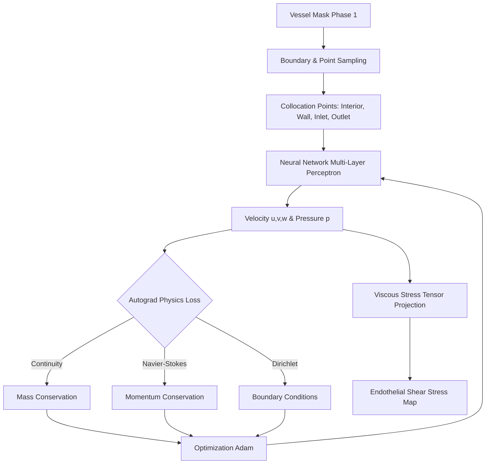

# Phase 2: Hemodynamic Surrogate (PINN)

## Overview
Phase 2 replaces computationally expensive Computational Fluid Dynamics (CFD) with a rapid **Physics-Informed Neural Network (PINN)**. It solves the 3D Navier-Stokes equations directly within the patient's vessel mask (generated in Phase 1) to map the blood flow velocity fields and compute the localized **Endothelial Shear Stress (ESS)**. 

Biologically, atherosclerotic plaque (calcium) is overwhelmingly driven by low ESS. This phase generates the hemodynamic risk map required to dictate where synthetic calcium will physically grow in Phase 3.

## Architecture & Workflow

## Methodology
The PINN takes 3D spatial coordinates $(x, y, z)$ as inputs and outputs velocities $(u, v, w)$ and pressure $(p)$. By utilizing PyTorch's automatic differentiation, we compute the exact physical residuals (Continuity and Momentum) and penalize the network until it discovers a valid fluid dynamic state that obeys Newtonian physics.

## Challenges & Solutions

### 1. Challenge: Non-Dimensional Scaling & Convergence
**The Problem:** Neural networks struggle to learn physical values with wildly different scales (e.g., velocities in m/s vs pressures in Pascals). Early iterations failed to converge.
**The Solution:** We implemented strict non-dimensionalization (scaling coordinates by $L_0$ and velocities by $U_0$). We dynamically match the Reynolds number ($Re \approx 150$) for coronary flow. 
*Bug Fix:* We corrected a dimensionless Jacobian error where viscous stress was off by a factor of $U_0/L_0$, ensuring the final ESS is outputted in true physical Pascals.

### 2. Challenge: Trivial Solutions (Velocity Collapse)
**The Problem:** The network frequently "cheated" the loss function by predicting $u=v=w=0$ everywhere, achieving perfect zero mass/momentum loss but failing physiologically.
**The Solution:** We enforced a hard parabolic velocity profile at the aortic ostium (inlet). Furthermore, we implemented a strict **Physiological Safety Gate**: If the network outputs a mean ESS below $0.1$ Pa, the pipeline throws a `RuntimeError` and aborts, refusing to pass non-physiological "junk" data to Phase 3.

### 3. Challenge: Numerical Artifacts at Outlets
**The Problem:** The artificial cut-planes at the vessel outlets caused massive spikes in computed shear stress due to mathematically jagged normals.
**The Solution:** We implemented a clipping algorithm that automatically deletes the last 1mm of the outlet boundaries and removes statistical $3\sigma$ outliers before exporting the final ESS point cloud.

## Outputs
- `ess_predictions.csv`: Dense point cloud containing physical coordinates and computed ESS magnitudes (in Pa).
