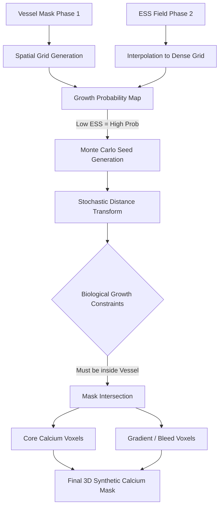

# Phase 3: Stochastic Plaque Growth (SDE)

## Overview
Phase 3 takes the hemodynamic risk maps (ESS) from Phase 2 and translates them into physical biology. Using a **Stochastic Differential Equation (SDE)** algorithm, it "grows" synthetic calcium deposits directly inside the patient's coronary arteries. 

By tying growth probabilities to low Endothelial Shear Stress, this phase guarantees that the synthetic calcium is placed in biologically accurate locations, matching real-world clinical distributions.

## Architecture & Workflow

## Methodology
Instead of dropping perfect geometric spheres into the scan, the growth mimics biological plaque accumulation:
1. **Seeding:** A Monte Carlo simulation probabilistically drops "seeds" onto the vessel wall, strictly favoring areas with ESS < 1.0 Pa.
2. **Growth:** A radial distance transform expands the seeds outward, but it is perturbed by a random-walk probability field to create lumpy, organic "nodules."
3. **Core vs Gradient:** The growth separates into a dense "core" and a surrounding "gradient" boundary, which is necessary for the alpha-blending texturing in Phase 4.

## Challenges & Solutions

### 1. Challenge: Unconstrained Bleeding
**The Problem:** Early growth algorithms would expand radially without limits, causing synthetic calcium to "bleed" out of the artery and into the surrounding myocardium or open lumen.
**The Solution:** We strictly enforced the Phase 1 vessel mask as an absolute bounding condition. The SDE mask intersection step ensures that calcium is mathematically impossible to generate outside the anatomical walls of the artery.

### 2. Challenge: Unrealistic "Spherical" Shapes
**The Problem:** Using standard Euclidean distance transforms resulted in perfectly spherical calcium deposits, which looked highly artificial on a CT scan and caused CNN detection models to overfit to spherical shapes.
**The Solution:** We implemented a Stochastic Distance Transform. By introducing random noise into the radial expansion limit, the calcium grows organically, forming realistic, asymmetric nodules.

## Outputs
- `synthetic_calcium_mask.nii.gz`: A binary mask containing the exact voxel locations of the newly grown synthetic plaque.
