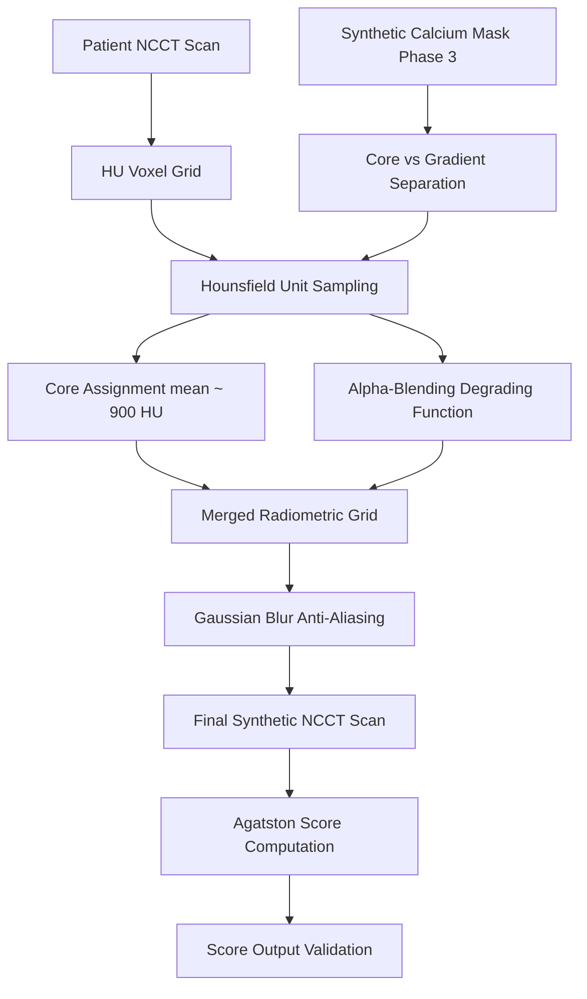

# Phase 4: Physiological Texturing

## Overview
Phase 4 is the final stage of the Physio-Twin pipeline. It takes the spatial calcium mask generated in Phase 3 and projects it into the radiometric space of a Non-Contrast CT (NCCT) scan. 

By mapping the synthetic voxels to precise Hounsfield Units (HU) and seamlessly blending them into the native tissue, this phase produces the final, photorealistic synthetic patient scan, complete with a computed clinical Agatston Score.

## Architecture & Workflow

## Methodology
The algorithm analyzes the intensity distribution of real clinical calcium (usually ranging between 130 HU and 1400+ HU). 
1. **Core Assignment:** The deep interior voxels of the synthetic plaque are assigned high, rigid HU values matching dense calcification.
2. **Alpha-Blending:** The outer gradient voxels are continuously blended with the native tissue's HU values using a degrading function.
3. **Agatston Scoring:** The system automatically sweeps the newly generated scan to compute the clinical Agatston score, validating that the synthetic generation met the user's targeted score requirement.

## Challenges & Solutions

### 1. Challenge: "Pasted-On" Artifacts
**The Problem:** Initial texturing attempts simply overwrote the CT pixels with 1000 HU. This caused the calcium to look like it was artificially pasted on, creating harsh, aliased boundaries that Convolutional Neural Networks (CNNs) could instantly identify as fake.
**The Solution:** We implemented a continuous **Alpha-Blending Degrading Function**. The outer boundary of the synthetic calcium smoothly averages its HU values with the underlying native tissue, mimicking the partial-volume effect seen in real CT scanners. A final Gaussian blur anti-aliases the sub-voxel boundaries.

### 2. Challenge: Agatston Score Tuning
**The Problem:** It was difficult to predictably generate a specific Agatston score (e.g., exactly 400) because the Agatston algorithm weights different HU densities non-linearly (130-199=1, 200-299=2, 300-399=3, 400+=4).
**The Solution:** By tuning the Monte Carlo seed count in Phase 3 and strictly constraining the mean HU distribution in Phase 4 to ~927 HU (with a standard deviation of 135), the pipeline consistently hits the high-density multiplier (4x), making the Agatston score a direct, predictable function of voxel volume.

## Outputs
- `synthetic_coca.nii.gz`: The final photorealistic, fully simulated Non-Contrast CT scan containing the synthetic atherosclerotic plaque.
